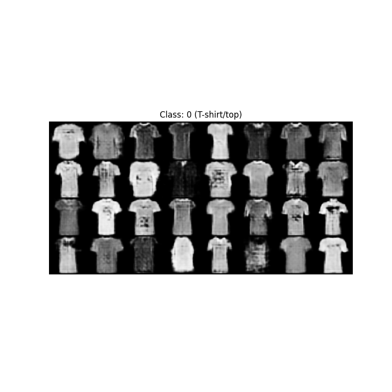

# WGAN-GP with Conditional Labels on FashionMNIST

This project implements a **Conditional Wasserstein Generative Adversarial Network with Gradient Penalty (WGAN-GP)** to generate FashionMNIST images conditioned on class labels.

## 📌 Objective
The goal is to train a generator capable of producing realistic **64x64 grayscale images** of FashionMNIST clothing items, conditioned on one of the **10 dataset classes**.

## 🧠 Model Architecture

### Generator
- Input:  
  - Noise vector `z` of size `100`  
  - Class label embedding (size `100`)
- Fully convolutional architecture to produce **1-channel 64x64** output images.
- Conditional input via label embeddings concatenated with noise.

### Critic (Discriminator)
- Input: Image + label embedding (expanded to image size).
- Outputs a scalar score without sigmoid activation (Wasserstein distance approximation).
- Uses **gradient penalty** for Lipschitz constraint.

## 🔬 Training Details
- **Dataset:** FashionMNIST (10 classes, grayscale)
- **Image size:** 64x64  
- **Batch size:** 64  
- **Noise vector size (z):** 100  
- **Label embedding size:** 100  
- **Learning rate:** 1e-4  
- **Optimizer:** Adam (betas=(0.0, 0.9))  
- **Critic iterations per generator step:** 5  
- **Gradient penalty coefficient:** 10  
- **Epochs:** 5 (configurable)

## ▶️ How to Train
1. Install dependencies:
   ```bash
   pip install torch torchvision matplotlib numpy
   ```
2. Run training:
   ```bash
   python train.py
   ```
   - The script will save generator and critic weights to `saved_models/`.

## ▶️ How to Generate Images
1. Make sure `saved_models/gen.pth` exists (trained generator).
2. Run:
   ```bash
   python main.py
   ```
   - This will generate 32 samples for each class and display them using matplotlib.

## 📊 Sample Output
During training, the script will display **real** and **generated** images for visual comparison.

## 🖼️ Example Results



